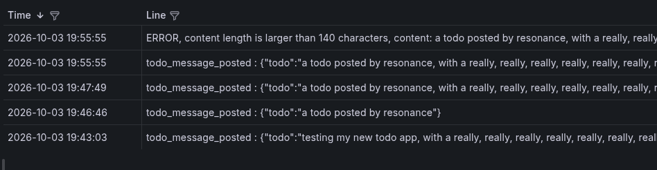

# cluster monitoring setup

### deployment being done by:
following the bash commands ins 'startup_commands.txt'

### port forward:
after creating a port-forward with:
```
kubectl port-forward --namespace monitoring svc/grafana 3000:80
```

### now open a browser to:

[localhost:3000](http://localhost:3000)

and login with admin / admin, and you are lookng at the Grafana dashboard. Choose for 'Loki' in the top status bar.

Some fun things to watch:
```
see all back-end related logging:
{namespace="project", container="todo-app-backend"}

all messages posted to /todos, including the errors:
{namespace="project", container="todo-app-backend"} |= "ERROR" or "todo_message_posted"
```

will show something like:



